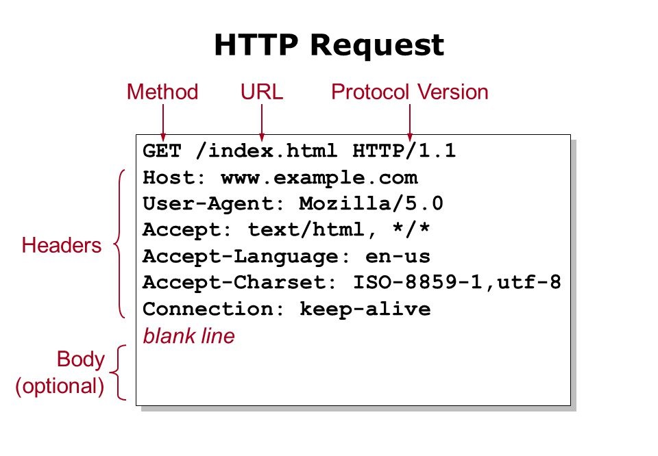

# WebServ

### HTTP Protocol

HTTP stands for Hypertext Transfer Protocol. It is an application-layer protocol that allows communication between clients and servers over the internet.

The HTTP protocol works on a client-server model, where the client sends a request to the server and the server responds with the requested data. The request and response are made up of different components, including:

### Visual Representation of an HTTP Request

<p align="center">
  
</p>

- **Request Method**: Specifies the type of request being made (e.g., GET, POST, PUT, DELETE).
- **URL**: The address of the resource being requested.
- **Headers**: Additional information about the request or response (e.g., content type, cookies).
- **Body**: Optional data sent with the request or response.

### Visual Representation of an HTTP Response

<p align="center">
  
</p>

### Web Server

A web server is a software application that serves web pages to clients upon request. It listens for incoming HTTP requests, processes them, and sends back the requested resources. The main components of a web server include:

- **Listener**: Listens for incoming requests on a specific port.
- **Router**: Routes the incoming requests to the appropriate handler based on the URL.
- **Handler**: Processes the request and generates the appropriate response.
- **Response**: Contains the requested resource and additional information (e.g., headers, status code).

The web server handles multiple client connections simultaneously using various techniques such as multi-threading or asynchronous I/O.

In the context of the Project WebServ, you will be implementing a web server that can handle HTTP requests and serve static files.

### Project Requirements

The WebServ project has the following requirements:

- **HTTP Server**: Implement a web server that can handle HTTP requests.
- **Configuration File**: Read server configuration from a file.
- **Virtual Hosts**: Support multiple virtual hosts with different configurations.
- **Methods**: Implement support for GET, POST, and HEAD methods.
- **Status Codes**: Return appropriate status codes in the response.
- **Error Handling**: Handle errors gracefully and return appropriate error messages.
- **Logging**: Log server events and requests to a log file.
- **Security**: Implement basic security features to protect against common attacks.
- **Performance**: Optimize the server for performance and scalability.
- **Documentation**: Provide clear documentation on how to build, run, and use the server.
- **Bonus**: Implement Python and PHP CGI, and cookie support.

## Installation:

1. **Clone the Repository**:

```bash
git clone https://github.com/gkrusta/Webserv webserv
```

2. **Build the Project**:

```bash
cd webserv/webserver && make
```

3. **Run the Server**:

```bash
./webserv config_file
```

4. **Test the Server cURL**: 
- File var/curl/CurlCommands.txt contains some curl commands to test the server.

5. **Test the Server with sige**:
- Test the server with sige, a simple HTTP load tester. Install it and execute the following command:
- -b stands for benchmark meaning that the requests are being send without waiting the repsonse of previous request.
- -c stands for number of clients
- -t stands for time the test will be executed
- you must use the conection version 127.0.0.1
```bash
siege -b -t50s -c25 http://127.0.0.1:8080/
```

# Understanding Cookies in Webserv
- Cookies are small pieces of data stored by a web server on a client's browser.
- Cookies are crucial for session management. They can store session identifiers that help the server recognize individual users and maintain session state.

### How Cookies Work In Our Webserv

- Vector of Strings: Each time the client refreshes or makes a new request to cookie.localhost:8080 within the Max-Age, the server records the current timestamp in a vector of strings. This vector holds all login timestamps, showing each interaction with the server.
- Display Session Data: As the client continues to interact with the server within the cookie's lifespan, these timestamps are displayed on the screen, providing a log of session activity.

### Example of a Set-Cookie Header

```bash
Set-Cookie: session_id=123456; Max-Age=3600; Path=/; Secure; HttpOnly
```

- Max-Age=3600 means the cookie will expire 3600 seconds (1 hour) after it is set
➡  Start Time Count: From the moment the cookie is set, the countdown begins for the cookie’s expiration.
- session_id is a random string generated for each new client
  
### Cookie Expiration and Session Reset
- Expiration: After the cookie reaches its Max-Age, the browser stops including the cookie in requests to the server.
- New Session Initialization: Upon the next client request after expiration, the server notices the absence of the cookie and issues a new Set-Cookie command, starting the cycle anew.
- Clear Previous Session Data: Concurrently, the server clears the existing vector of login timestamps, ensuring that the new session starts fresh without old data.

```bash
Initial Visit: No Cookie Found
-> Server sets new cookie and logs visit.
Subsequent Visits: Cookie Present
-> Server logs additional visits.
After Expiration: No Cookie
-> Server sets new cookie and resets login history.
```

### Visual Representation of Cookie Flow


## Resources

- [HTTP Protocol](https://developer.mozilla.org/en-US/docs/Web/HTTP) - Mozilla Developer Network, helpful resource for learning about the HTTP protocol. <b>Highly recommended.</b>

- [Beej's Guide to Network Programming Using Internet Sockets](https://beej.us/guide/bgnet/html/) - A comprehensive guide to network programming using sockets. <b>Highly recommended.</b>

- [HTTP response status codes](https://developer.mozilla.org/en-US/docs/Web/HTTP/Status) - All about HTTP code ranges, cookies, redirections.

- [Nginx Documentation](https://nginx.org/en/docs/) - Official documentation for the Nginx web server, a popular open-source web server.

- [cURL Documentation](https://curl.se/docs/) - Official documentation for cURL, a command-line tool for transferring data with URLs.

## Teammates:

 🐒   [dbredykh](https://github.com/BredyByte/)   &   🦍   [pvilchez](https://github.com/pablovilchez)
